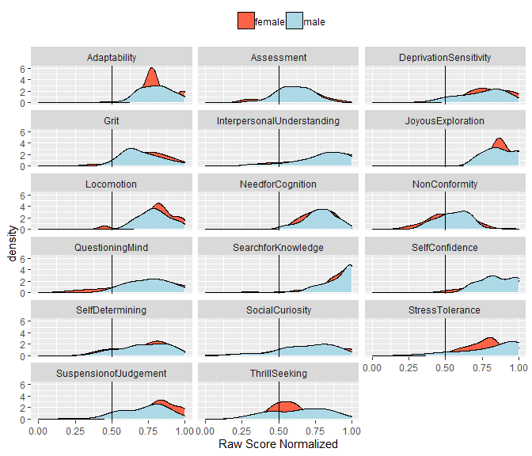
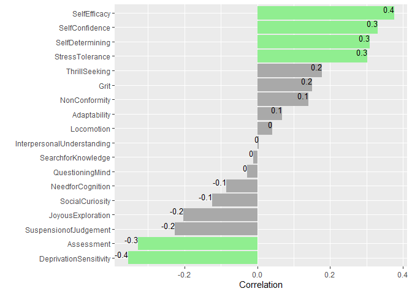

Northrop Grumman CATTConV Survey Results
================

#### 62 Northrop Grumman Cybersecurity Professionals and 40 other Northrop Grumman Professionals (ex. Program Managers, Systems Engineers) participated in this data collection.

##### Research aims:

  - Identify personality traits that are common among Northrop Grumman’s
    Cybersecurity Professionals
  - Determine raw score distributions and density functions for 17
    personality dimensions; understand variability among cybersecurity
    workers
  - Verify factor analysis for 17 personality measures (i.e. degree
    individual questions are measuring the intended personality trait)
  - Identify potential components to a predictive model of latent talent
    for cybersecurity work roles
  - Refine the personality questionnaire

##### Results and analysis from this data collection will assist Northrop Grumman Project Work in support of the Army Research Institute and the Army’s Cyber Proponent.

## Education Column Plot

##### Highest degree of Northrop Grumman Cybersecurity Professionals. 76 percent have degrees in Computer Science or CS related fields.

<!-- -->

## Experience Histogram

##### Northrop Grumman Cybersecurity Professionals reported, on average, 11 years years of experience.

<!-- -->

## Certifications Word Cloud

##### Northrop Grumman Cybersecurity Professionals reported, on average, 2-3 certifications.

<!-- -->

## Hobbies Word Cloud

##### Hobbies reported by Northrop Grumman Cybersecurity Professionals.

<!-- -->

## Personality Trait Raw Scores

##### Northrop Grumman Cybersecurity Professionals’ trait raw scores are displayed in the light green density plots. Northrop Grumman Professionals who did not specify a cybersecuirty role are displayed beyind in the light blue density plots.

<!-- -->

    ##  female    male unknown    NA's 
    ##     324    1008     504    1836

##### The description of each personality dimension is at the bottom of this page. *NonConformity* appears to be least important in this sample and has limited variability around the center of this scale.

## Personality Traits and Experience Correlations

##### Data analysis determined several moderate correlations (0.3 - 0.5) between personality traits and years of experience suggesting select traits may change or adapt with longevity in a career.

<!-- -->

##### Positive Correlations with Years of Experience

  - *Self-Efficacy*: belief in one’s own ability to deal with a
    prospective situation in cybersecurity roles.
  - *SelfConfidence*: Someone who would be unafraid to pursue a
    resolution when he/she uncovers a questionable activity.
  - *SelfDetermining*: Taking a step back from an issue, position, or
    posture and asking “does this make sense to me?”
  - *StressTolerance*: Ability to cope win the anxiety inherent in
    confronting the new, unexpected, complex, mysterious, and obscure
    events.

##### Negative Correlations with Years of Experience

  - *Assessment*: focus on self-evaluation and “doing the right thing.”
  - *DeprivationSensitivity*: Seeking information to escape the tension
    of not knowing something. Intellectually engaged to think about
    abstract or complex ideas and solve problems.

## Self-Efficacy Correlations

##### Northrop Grumman Cybersecurity and Non-cybersecurity respondents rated self-efficacy for “the level of knowledge” and “the ability” to work in the cybersecurity field". Several personality dimensions display moderate positive correlations.

<!-- -->

##### Cybersecurity Professionals: Self-Confidence and Need for Cognition correlated highest.

##### Non-cybersecurity Professionals: Joyous Exploration and Stress Tolerance correlated highest.

## K Means Clustering (All Personality Dimensions)

##### Three personality profiles (clusters) were developed from the respondent trait scores. Highlighted in green are traits with a relatively high cluster average. In blue are traits with a relatively low cluster average.

<!-- -->

##### The largest cluster, *Cluster 3* (42%), generally reports average to high scores across all the dimensions.

##### *Cluster 1* (27%) and *Cluster 2* (30%) , consists of respondents with a specific combination of lower scores across several dimensions.

<!-- -->

## Latent Profile Analysis (All Item level data)

##### Two personality profiles (clusters) were developed using latent profile analysis (LPA) using the mclust pacakge in R. A comparison of probabilisitc models demonstrated that 2 clusters best fit the data. . Highlighted in green are traits with a relatively high cluster average. In blue are traits with a relatively low cluster average.

<!-- -->

##### The largest cluster, *Cluster 1* (57%), reports average to high scores across all the dimensions.

##### *Cluster 2* (43%) consists of respondents with a specific combination of lower scores across several dimensions.

##### Select personality traits displayed greater variation among two clusters of Northrop Grumman professionals. Stress Tolerance and Need for Cognition, for example, seem to play a large role in determining the cluster assignments. Traits such as Assessment, Social Curiosity, Deprivation Sensitivity, Thrill Seeking, Non-Conformity and Suspension of Judgement appear to have less impact in cluster assignment.

<!-- -->

## Correlation of Dimensions used in Questionnaire

<!-- -->

##### Correlation coefficients are displayed and shaded. Green boxes are drawn from the results of hierarchical clustering of these personality dimensions. For example, respondent data suggests “Search for Knowledge” and “Joyous Exploration” seemingly measure the same trait.

## References:

###### Adaptability and Conformity, International Personality Item Pool: A Scientific Collaboratory for the Development of Advanced Measures of Personality Traits and Other Individual Differences. <http://ipip.ori.org/>

###### Cacioppo, J. T., Petty, R. E., and Kao, C. F. (1984). The efficient assessment of need for cognition. *Journal of Personality Assessment*, 48, 306-307.

###### Duckworth, A. L. & Quinn, P. D. (2009). Development and validation of the Short Grit Scale (Grit-S). *Journal of Personality Assessment*, 91(2), 166-174.

###### Hurt, R. K. (2010, May). Development of a Scale to Measure Professional Skepticism. *Auditing: A Journal of Practice and Theory*, 29(1), 149-171.

###### Kashdan, T. B., Stiksma, M. C., Disabato, D. J., Mcknight, P. E.,, Bekier, J., Kaji, J., Lazarus, R. (2017, December). The Five-Dimension Curiosity Scale: Capturing the bandwidth of curiosity and identifying four unique subgroups of curious people. *Journal for Research in Personality*, 73, 130-149.

###### Kruglanski, A. W., Thompson, E. P., Higgins, E. T., Atash, M. N., Pierro, A., Shah, J. Y., Spiegel, S. (2000, Nov). To “do the right thing” or to “just do it”: Locomotion and assessment as distinct self-regulatory imperatives. *Journal of Personality and Social Psychology*, 79(5), 793-815.

######  Scrucca L., Fop M., Murphy T. B. and Raftery A. E. (2016) mclust 5:  clustering, classification and density estimation using Gaussian finite mixture models The R Journal 8/1, pp. 289-317.  

#### Definitions of Personality Dimensions

  - *SearchforKnowledge*: Ability to ask questions beyond the obvious
    answer.
  - *StressTolerance*: Ability to cope win the anxiety inherent in
    confronting the new, unexpected, complex, mysterious, and obscure
    events.
  - *JoyousExploration*: Preference for new information and experiences,
    and the valuing of self-expansion over security.
  - *SelfConfidence*: Someone who would be unafraid to pursue a
    resolution when he/she uncovers a questionable activity.
  - *InterpersonalUnderstanding*: Not placing inappropriate degree of
    trust in people, processes, controls and data.
  - *Locomotion*: decisiveness, task orientation, intrinsic motivation
    to get the job done.
  - *SuspensionofJudgement*: Characteristic of withholding a conclusion
    on a matter until sufficient evidence to form a basis for a
    reasonable conclusion has been obtained
  - *DeprivationSensitivity*: Seeking information to escape the tension
    of not knowing something. Intellectually engaged to think about
    abstract or complex ideas and solve problems.
  - *Need for Cognition*: engage and enjoy effortful cognitive
    endeavors.
  - *SelfDetermining*: Taking a step back from an issue, position, or
    posture and asking “does this make sense to me?”
  - *Grit*: perseverance and passion for long-term goals.
  - *SocialCuriosity*: Desire to know what other people are thinking and
    doing through overt means (observing and probing questions) or
    covert means (listening into conversations or gathering second-hand
    information).
  - *QuestioningMind*: Attitude to look below the surface and see if the
    numbers, situation, factors or people look out of place.
  - *Adaptability*: ability to adjust to new conditions.
  - *Assessment*: focus on self-evaluation and “doing the right thing.”
  - *ThrillSeeking*: On the hunt for varied, novel, complex, and intense
    experiences and ready to risk physical, social, and financial
    safety.
  - *Non-Conformity*: refusal to conform to prevailing rules or
    practices.
