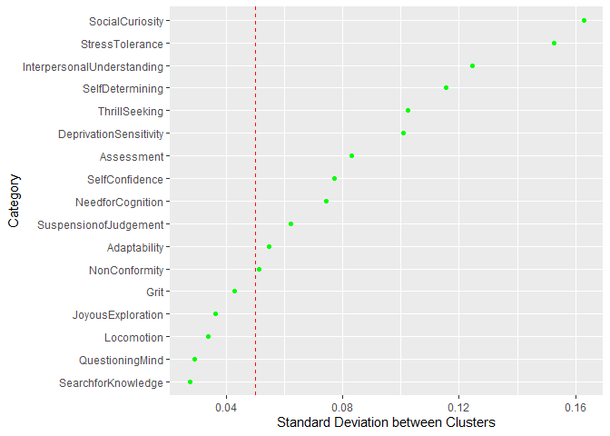

Northrop Grumman CATTConV Survey Results
================

#### 63 Northrop Grumman Cybersecurity Professionals participated in this data collection and 39 other Professionals (ex. Northrop Grumman Program Managers, Systems Engineers).

## Education Column Plot

##### Highest degree of Northrop Grumman Cybersecurity Professionals. 76 percent have degrees in Computer Science or CS related fields.

<!-- -->

## Experience Histogram

##### Northrop Grumman Cybersecurity Professionals reported, on average, 11 years years of experience.

<!-- -->

## Certifications Word Cloud

##### Northrop Grumman Cybersecurity Professionals reported, on average, 2-3 certifications.

<!-- -->

## Hobbies Word Cloud

##### Hobbies reported by Northrop Grumman Cybersecurity Professionals.

<!-- -->

## Personality Trait Raw Scores

##### Northrop Grumman Cybersecurity Professionals’ trait raw scores are displayed as density plots.

<!-- -->

##### The description of each personality dimension is at the bottom of this page. *NonConformity* appears to be least important in this sample and has limited variability around the center of this scale.

## Personality Traits and Experience Correlations

##### Data analysis determined several moderate correlations (0.3 - 0.5) between behavioral traits and years of experience.

<!-- -->

##### Positive Correlations with Years of Experience

  - *Self-Efficacy*: belief in one’s own ability to deal with a
    prospective situation in cybersecurity roles.
  - *SelfConfidence*: Someone who would be unafraid to pursue a
    resolution when he/she uncovers a questionable activity.
  - *SelfDetermining*: Taking a step back from an issue, position, or
    posture and asking “does this make sense to me?”
  - *StressTolerance*: Ability to cope win the anxiety inherent in
    confronting the new, unexpected, complex, mysterious, and obscure
    events.

##### Negative Correlations with Years of Experience

  - *Assessment*: focus on self-evaluation and “doing the right thing.”
  - *DeprivationSensitivity*: Seeking information to escape the tension
    of not knowing something. Intellectually engaged to think about
    abstract or complex ideas and solve problems.

## Self-Efficacy Correlations

##### Northrop Grumman Cybersecurity and Non-cybersecurity respondents rated self-efficacy for “the level of knowledge” and “the ability” to work in the cybersecurity field". Several personality dimensions display moderate positive correlations.

<!-- -->

##### Cybersecurity Professionals: Self-Confidence and Need for Cognition correlated highest

##### Non-cybersecurity Professionals: Joyous Exploration and Stress Tolerance correlated highest

## K Means Clustering I (Curiosity Dimensions)

##### Personality clustering results from respondent data for Curiosity (5 personality dimensions). The chart below is faceted into four clusters generally described by Kashdan et al. as:

##### Cluster 1: “Empathizers” (29%)

##### Cluster 2: “Fascinated” (26%)

##### Cluster 3: “Problem Solvers” (25%)

##### Cluster 4: “Avoiders” (20%)

<!-- -->

##### Read a description of these clusters on pages 13-14 of the following published article:

###### <https://www.researchgate.net/profile/Todd_Kashdan/publication/321471978_The_Five-Dimensional_Curiosity_Scale_Capturing_the_bandwidth_of_curiosity_and_identifying_four_unique_subgroups_of_curious_people/links/5ae34644aca272fdaf904f6f/The-Five-Dimensional-Curiosity-Scale-Capturing-the-bandwidth-of-curiosity-and-identifying-four-unique-subgroups-of-curious-people.pdf>

## K Means Clustering II (All Personality Dimensions)

##### Personality clustering results faceted based on variability in mean scores among the clusters (dimensions with high variability vs. dimensions with low variability).

<!-- -->

##### The largest cluster, *Cluster 2* (43%), generally reports high scores across all the dimensions and appears to resemble “Problem Solvers” and “Fascinated” personality profiles.

##### *Cluster 1* (27%) and *Cluster 3* (29%) , consists of respondents with lower scores on many dimensions and resemble “Avoiders” and “Empathizers”, respectively.

##### Low variability was observed between personality clusters in many dimensions.

## Correlation Analysis of Personality Dimensions

<!-- -->

##### Correlation coefficients are displayed and shaded. Green boxes are drawn from the results of hierarchical clustering of these personality dimensions. For example, respondent data suggests “Search for Knowledge” and “Joyous Exploration” measure the same trait.

## References:

###### Adaptability and Conformity, International Personality Item Pool: A Scientific Collaboratory for the Development of Advanced Measures of Personality Traits and Other Individual Differences. <http://ipip.ori.org/>

###### Cacioppo, J. T., Petty, R. E., and Kao, C. F. (1984). The efficient assessment of need for cognition. *Journal of Personality Assessment*, 48, 306-307.

###### Duckworth, A. L. & Quinn, P. D. (2009). Development and validation of the Short Grit Scale (Grit-S). *Journal of Personality Assessment*, 91(2), 166-174.

###### Hurt, R. K. (2010, May). Development of a Scale to Measure Professional Skepticism. *Auditing: A Journal of Practice and Theory*, 29(1), 149-171.

###### Kashdan, T. B., Stiksma, M. C., Disabato, D. J., Mcknight, P. E.,, Bekier, J., Kaji, J., Lazarus, R. (2017, December). The Five-Dimension Curiosity Scale: Capturing the bandwidth of curiosity and identifying four unique subgroups of curious people. *Journal for Research in Personality*, 73, 130-149.

###### Kruglanski, A. W., Thompson, E. P., Higgins, E. T., Atash, M. N., Pierro, A., Shah, J. Y., Spiegel, S. (2000, Nov). To “do the right thing” or to “just do it”: Locomotion and assessment as distinct self-regulatory imperatives. *Journal of Personality and Social Psychology*, 79(5), 793-815.

#### Definitions of Personality Dimensions

  - *SearchforKnowledge*: Ability to ask questions beyond the obvious
    answer.
  - *StressTolerance*: Ability to cope win the anxiety inherent in
    confronting the new, unexpected, complex, mysterious, and obscure
    events.
  - *JoyousExploration*: Preference for new information and experiences,
    and the valuing of self-expansion over security.
  - *SelfConfidence*: Someone who would be unafraid to pursue a
    resolution when he/she uncovers a questionable activity.
  - *InterpersonalUnderstanding*: Not placing inappropriate degree of
    trust in people, processes, controls and data.
  - *Locomotion*: decisiveness, task orientation, intrinsic motivation
    to get the job done.
  - *SuspensionofJudgement*: Characteristic of withholding a conclusion
    on a matter until sufficient evidence to form a basis for a
    reasonable conclusion has been obtained
  - *DeprivationSensitivity*: Seeking information to escape the tension
    of not knowing something. Intellectually engaged to think about
    abstract or complex ideas and solve problems.
  - *Need for Cognition*: engage and enjoy effortful cognitive
    endeavors.
  - *SelfDetermining*: Taking a step back from an issue, position, or
    posture and asking “does this make sense to me?”
  - *Grit*: perseverance and passion for long-term goals.
  - *SocialCuriosity*: Desire to know what other people are thinking and
    doing through overt means (observing and probing questions) or
    covert means (listening into conversations or gathering second-hand
    information).
  - *QuestioningMind*: Attitude to look below the surface and see if the
    numbers, situation, factors or people look out of place.
  - *Adaptability*: ability to adjust to new conditions.
  - *Assessment*: focus on self-evaluation and “doing the right thing.”
  - *ThrillSeeking*: On the hunt for varied, novel, complex, and intense
    experiences and ready to risk physical, social, and financial
    safety.
  - *Non-Conformity*: refusal to conform to prevailing rules or
    practices.
