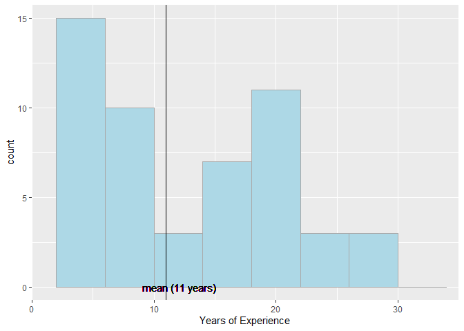
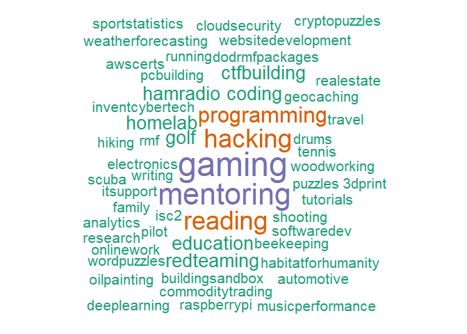
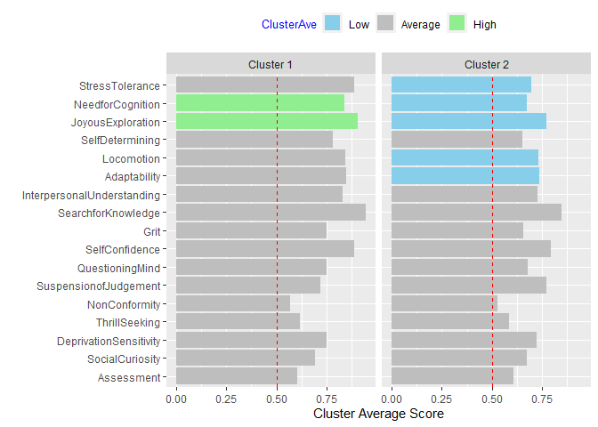

### Demographic Information (Education, Certificaitons, Hobbies)

##### Education: Highest degree achieved by percentage of cybersecuirty professionals.

<!-- -->

##### Certifications: Certification(s) achieved by percentage of cybersecurity professionals.

<!-- -->

##### Hobbies: hobbies reported by cybersecurity professionals.

| Hobbies                                                                           |
| :-------------------------------------------------------------------------------- |
| ML                                                                                |
| Red Teaming                                                                       |
| Security                                                                          |
| AWS Certs Solutions Arch                                                          |
| Beekeeping                                                                        |
| Conferences                                                                       |
| Crossword puzzles                                                                 |
| CTFs                                                                              |
| Cyber Patriot Mentoring                                                           |
| Discover/tap into expertise of others                                             |
| Electronics                                                                       |
| Engineer Mentor programs University Student Engineers                             |
| Game Play                                                                         |
| Gaming                                                                            |
| Ham Radio                                                                         |
| Identify/repair from the root cause -pro-active approach to known versus reactive |
| Increase knowledge for current/changing needs                                     |
| Machine Learning / AI Tensorflow                                                  |
| Marine Corps Cyber Auxiliary                                                      |
| Perform Compliance reviews to make others succeed                                 |
| Presenting Hackerspaces                                                           |
| Private Pilot                                                                     |
| Programming                                                                       |
| Pursuing Master’s in SE                                                           |
| Quantum Computing MIT                                                             |
| Red Team participation                                                            |
| Running                                                                           |
| SCUBA                                                                             |
| shooting                                                                          |
| Software Development/coding                                                       |
| Sports statistics                                                                 |
| Training/teaching/mentoring others                                                |
| Travel                                                                            |
| Video Game Hacking                                                                |
| Volunteering for Events Hackathongs                                               |
| Website development                                                               |
| Woodworking                                                                       |

### Behavioral Trait Importance

##### Results of **importance ratings** of 8 personality categories for performance in cybersecurity roles.

  - *Adaptability*: ability to adjust to new conditions.
  - *Assessment*: focus on self-evaluation and “doing the right thing.”
  - *Curiosity*: seek out situations with potential for new information
    and experiences.
  - *Grit*: perseverance and passion for long-term goals.
  - *Locomotion*: decisiveness, task orentiation, intrinsic motivation
    to get the job done.
  - *Need for Cognition*: engage and enjoy effortful cognitive
    endeavors.
  - *Non-Conformity*: refusal to conform to prevailing rules or
    practices.
  - *Skepticism*: critically asssessing evidence before making a
    decision.

##### Mean scores are reproted in green dots with 95% confidence intervals.

##### **Scale: 1 - Not Important, 7 - Very Important**

<!-- -->

### Distribution of Respondent Raw Scores: check for normal distribution

<!-- -->

### Personality Trait Raw Scores (8 Categories)

##### Median values are in **red text**.

  - *Adaptability*: ability to adjust to new conditions.
  - *Assessment*: focus on self-evaluation and “doing the right thing.”
  - *Curiosity*: seek out situations with potential for new information
    and experiences.
  - *Grit*: perseverance and passion for long-term goals.
  - *Locomotion*: decisiveness, task orentiation, intrinsic motivation
    to get the job done.
  - *Need for Cognition*: engage and enjoy effortful cognitive
    endeavors.
  - *Non-Conformity*: refusal to conform to prevailing rules or
    practices.
  - *Skepticism*: critically asssessing evidence before making a
    decision.

<!-- -->

### Personality Trait: Curiosity Category (5 Dimensions)

  - *DeprivationSensitivity*: Seeking information to escape the tension
    of not knowing something. Intellectually engaged to think about
    abstract or complex ideas and solve problems.
  - *JoyousExploration*: Preference for new information and experiences,
    and the valuing of self-expansion over security.
  - *SocialCuriosity*: Desire to know what other people are thinking and
    doing through overt means (observing and probing questions) or
    covert means (listening into conversations or gathering second-hand
    information).  
  - *StressTolerance*: Ability to cope win the anxiety inherent in
    confronting the new, unexpected, complex, mysterious, and obscure
    events.
  - *ThrillSeeking*: On the hunt for varied, novel, complex, and intense
    experiences and ready to risk physical, social, and financial
    safety.

<!-- -->

### Personality Trait: Skepticism Category (6 Dimensions)

  - *QuestioningMind*: Attitude to look below the surface and see if the
    numbers, situation, factors or people look out of place.
  - *SelfConfidence*: Someone who would be unafraid to pursue a
    resolution when he/she uncovers a questionable activity.
  - *InterpersonalUnderstanding*: Not placing inappropriate degree of
    trust in people, processes, controls and data.
  - *SearchforKnowledge*: Ability to ask questions beyond the obvious
    answer.
  - *SelfDetermining*: Taking a step back from an issue, position, or
    posture and asking “does this make sense to me?”
  - *SuspensionofJudgement*: Characteristic of withholding a conclusion
    on a matter until sufficient evidence to form a basis for a
    reasonable conclusion has been obtained.

<!-- -->

### Self-Efficacy reported by technical level (High, Medium, Low)

  - *Self-Efficacy*: belief in one’s own ability to deal with a
    prospective situation in cybersecurity roles.

##### **Scale: 1 - low confidence in ability, 7 - very high confidence in ability**

<!-- -->

### Correlation of Personality Dimensions

##### Green boxes are drawn around results of hierarchical clustering of these personality dimensions.

<!-- -->

#### References:

###### Adaptability and Conformity, International Personality Item Pool: A Scientific Collaboratory for the Development of Advanced Measures of Personality Traits and Other Individual Differences. <http://ipip.ori.org/>

###### Cacioppo, J. T., Petty, R. E., and Kao, C. F. (1984). The efficient assessment of need for cognition. *Journal of Personality Assessment*, 48, 306-307.

###### Duckworth, A. L. & Quinn, P. D. (2009). Development and validation of the Short Grit Scale (Grit-S). *Journal of Personality Assessment*, 91(2), 166-174.

###### Hurt, R. K. (2010, May). Development of a Scale to Measure Professional Skepticism. *Auditing: A Journal of Practice and Theory*, 29(1), 149-171.

###### Kashdan, T. B., Stiksma, M. C., Disabato, D. J., Mcknight, P. E.,, Bekier, J., Kaji, J., Lazarus, R. (2017, December). The Five-Dimension Curiosity Scale: Capturing the bandwidth of curisity and identifying four unique subgrups of curious people. *Journal for Research in Personality*, 73, 130-149.

###### Kruglanski, A. W., Thompson, E. P., Higgins, E. T., Atash, M. N., Pierro, A., Shah, J. Y., Spiegel, S. (2000, Nov). To “do the right thing” or to “just do it”: Locomotion and assessment as distinct self-regulatory imperatives. *Journal of Personality and Social Psychology*, 79(5), 793-815.
