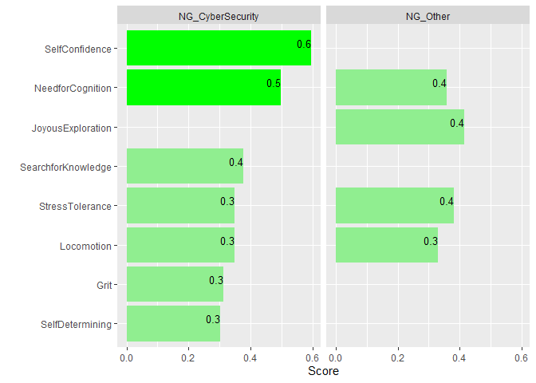

  Northrop Grumman CATTConV Survey Results
================

#### 63 Northrop Grumman Cybersecurity Professionals participated in this data collection and 39 other Professionals (ex. Northrop Grumman Program Managers, Systems Engineers).

## Cyberseucrity Particpants Education Column Plot

##### Highest degree of Northrop Grumman Cybersecuirty Professionals. 76 percent have degrees in Computer Science or CS related fields.

<!-- -->

## Experience Histogram

##### Northrop Grumman Cybersecuirty Professionals reported, on average, 11 years years of experience.

<!-- -->

## Certifications Word Cloud

##### Northrop Grumman Cybersecurity Professionals reported, on average, 2-3 certifications.

<!-- -->

## Hobbies Word Cloud.

##### Hobbies reported by Northrop Grumman Cybersecurity Professionals.

<!-- -->

## Personality Trait Boxplots

##### Northrop Grumman Cybersecurity professionals are displayed in the **green** boxplots.

##### Boxplots graphically depict numerical data through their quartiles. The median value is labeled in **red** text. Outliers are plotted as black dots.

##### T Scores are used to display results in comparison to a reference. A T Score of 50 represents the population average, with 40 and 60 representing one standard deviation higher and lower than the population, respectively.

##### These T Scores were based on results published in peer reviewed literature noted in the References and data available from the Eugene-Springfield Community Sample at <https://dataverse.harvard.edu/dataverse/ESCS-Data>.

<!-- -->

##### The definition of each dimension, in order of their scores among Northrop Grumman’s Cybersecurity Professionals, is as follows:

  - *StressTolerance*: Ability to cope win the anxiety inherent in
    confronting the new, unexpected, complex, mysterious, and obscure
    events.
  - *Locomotion*: decisiveness, task orentiation, intrinsic motivation
    to get the job done.
  - *JoyousExploration*: Preference for new information and experiences,
    and the valuing of self-expansion over security.
  - *Non-Conformity*: refusal to conform to prevailing rules or
    practices.
  - *DeprivationSensitivity*: Seeking information to escape the tension
    of not knowing something. Intellectually engaged to think about
    abstract or complex ideas and solve problems.
  - *Adaptability*: ability to adjust to new conditions.
  - *ThrillSeeking*: On the hunt for varied, novel, complex, and intense
    experiences and ready to risk physical, social, and financial
    safety.
  - *Need for Cognition*: engage and enjoy effortful cognitive
    endeavors.
  - *SocialCuriosity*: Desire to know what other people are thinking and
    doing through overt means (observing and probing questions) or
    covert means (listening into conversations or gathering second-hand
    information).
  - *Professional Skepticism*: Characteristic of withholding a
    conclusion on a matter until sufficient evidence to form a basis for
    a reasonable conclusion has been obtained; Taking a step back from
    an issue, position, or posture and asking “does this make sense to
    me?”; Attitude to look below the surface and see if the numbers,
    situation, factors or people look out of place; Ability to ask
    questions beyond the obvious answer; Not placing inappropriate
    degree of trust in people, processes, controls and data; Someone who
    would be unafraid to pursue a resolution when he/she uncovers a
    questionable activity.
  - *Assessment*: focus on self-evaluation and “doing the right thing.”
  - *Grit*: perseverance and passion for long-term goals.

## Personality Traits and Years of Experience

##### Data analysis determined several Moderate correlations between Behavioral Traits and Years of Experience.

<!-- -->

##### Positive Correlations with Experience

  - *Self-Efficacy*: belief in one’s own ability to deal with a
    prospective situation in cybersecurity roles.
  - *SelfConfidence*: Someone who would be unafraid to pursue a
    resolution when he/she uncovers a questionable activity.
  - *SelfDetermining*: Taking a step back from an issue, position, or
    posture and asking “does this make sense to me?”
  - *StressTolerance*: Ability to cope win the anxiety inherent in
    confronting the new, unexpected, complex, mysterious, and obscure
    events.

##### Negative Correlations with Experience

  - *Assessment*: focus on self-evaluation and “doing the right thing.”
  - *DeprivationSensitivity*: Seeking information to escape the tension
    of not knowing something. Intellectually engaged to think about
    abstract or complex ideas and solve problems.

## Self-Efficacy Correlations

##### Northrop Grumman Cybersecurity and non-cybersecurity Respondants rated Self-Efficacy (one’s own ability) for the knowledge and abilty to work in the cybersecurity field.

<!-- -->

##### Cybersecurity Professionals: Self-Confidence and Need for Cognition correlated highest

##### Non-cybersecurity Professionals: Joyous Exploration, Stress Tolerance, and Locomotion correlated highest

### K Means Clustering

##### K means clustering identified three distinct personality profiles based on survey responses. The chart below is faceted into two groups of personality dimensions based on deviation between clusters (high and low).

<!-- -->

##### The largest cluster, *Cluster 1*, generally scored high across all the dimensions.

##### Cluster 2, consists of respondants with significantly lower scores on Stress Tolerance, Self Determining, Thrill Seeking and higher Suspension of Judgement.

##### Cluster 3, consists of respondants with significantly lower scores on Social Curiosity, Interpersonal Understanding, Thrill Seeking, Deprivation Sensitivity, and Assessment.

##### Little variability was observed between personality clusters in the following dimensions: Non-Conformity, Search for Knowledge, Joyous Exploration, Questioning Mind, Locomotion, Adaptabiliy, Grit, Suspension of Judgement.

## Correlation Analysis of the Questionnaire’s Personality Dimensions

##### Correlation coefficients are displayed and shaded based on strength.

##### Green boxes are drawn from Hierarchical Clustering of personality dimensions.

<!-- -->

#### References:

###### Adaptability and Conformity, International Personality Item Pool: A Scientific Collaboratory for the Development of Advanced Measures of Personality Traits and Other Individual Differences. <http://ipip.ori.org/>

###### Cacioppo, J. T., Petty, R. E., and Kao, C. F. (1984). The efficient assessment of need for cognition. *Journal of Personality Assessment*, 48, 306-307.

###### Duckworth, A. L. & Quinn, P. D. (2009). Development and validation of the Short Grit Scale (Grit-S). *Journal of Personality Assessment*, 91(2), 166-174.

###### Hurt, R. K. (2010, May). Development of a Scale to Measure Professional Skepticism. *Auditing: A Journal of Practice and Theory*, 29(1), 149-171.

###### Kashdan, T. B., Stiksma, M. C., Disabato, D. J., Mcknight, P. E.,, Bekier, J., Kaji, J., Lazarus, R. (2017, December). The Five-Dimension Curiosity Scale: Capturing the bandwidth of curisity and identifying four unique subgrups of curious people. *Journal for Research in Personality*, 73, 130-149.

###### Kruglanski, A. W., Thompson, E. P., Higgins, E. T., Atash, M. N., Pierro, A., Shah, J. Y., Spiegel, S. (2000, Nov). To “do the right thing” or to “just do it”: Locomotion and assessment as distinct self-regulatory imperatives. *Journal of Personality and Social Psychology*, 79(5), 793-815.

#### Definitions of Personality Dimensions

  - *SearchforKnowledge*: Ability to ask questions beyond the obvious
    answer.
  - *StressTolerance*: Ability to cope win the anxiety inherent in
    confronting the new, unexpected, complex, mysterious, and obscure
    events.
  - *JoyousExploration*: Preference for new information and experiences,
    and the valuing of self-expansion over security.
  - *SelfConfidence*: Someone who would be unafraid to pursue a
    resolution when he/she uncovers a questionable activity.
  - *InterpersonalUnderstanding*: Not placing inappropriate degree of
    trust in people, processes, controls and data.
  - *Locomotion*: decisiveness, task orentiation, intrinsic motivation
    to get the job done.
  - *SuspensionofJudgement*: Characteristic of withholding a conclusion
    on a matter until sufficient evidence to form a basis for a
    reasonable conclusion has been obtained
  - *DeprivationSensitivity*: Seeking information to escape the tension
    of not knowing something. Intellectually engaged to think about
    abstract or complex ideas and solve problems.
  - *Need for Cognition*: engage and enjoy effortful cognitive
    endeavors.
  - *SelfDetermining*: Taking a step back from an issue, position, or
    posture and asking “does this make sense to me?”
  - *Grit*: perseverance and passion for long-term goals.
  - *SocialCuriosity*: Desire to know what other people are thinking and
    doing through overt means (observing and probing questions) or
    covert means (listening into conversations or gathering second-hand
    information).
  - *QuestioningMind*: Attitude to look below the surface and see if the
    numbers, situation, factors or people look out of place.
  - *Adaptability*: ability to adjust to new conditions.
  - *Assessment*: focus on self-evaluation and “doing the right thing.”
  - *ThrillSeeking*: On the hunt for varied, novel, complex, and intense
    experiences and ready to risk physical, social, and financial
    safety.
  - *Non-Conformity*: refusal to conform to prevailing rules or
    practices.
